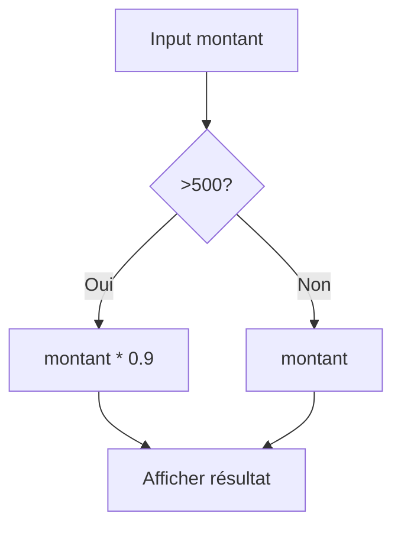
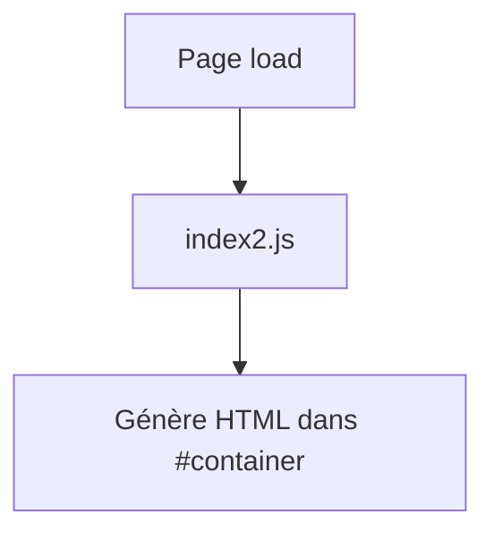
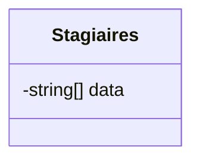
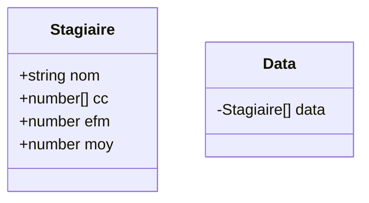
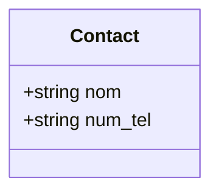

# Documentation Complète des Exercices JavaScript

## Table des Matières
- [Exercice 1: Calculateur de Montant (EXRCICE1)](#exercice-1-calculateur-de-montant-exrcice1)
- [Exercice 2: Formulaire de Connexion (EXERCICE2)](#exercice-2-formulaire-de-connexion-exercice2)
- [Exercice 3: Génération Dynamique (EXERCICE3)](#exercice-3-génération-dynamique-exercice3)
- [Exercice 4: Liste Basique Stagiaires (EXERCICE4)](#exercice-4-liste-basique-stagiaires-exercice4)
- [Exercice 5: Gestion Stagiaires Notes (exercice5)](#exercice-5-gestion-stagiaires-notes-exercice5)
- [Exercice 6: Objets Basique (EXERCICE6OBJET)](#exercice-6-objets-basique-exercice6objet)
- [Exercice 7: CRUD Avancé Stagiaires (EXERCICE7OBJET)](#exercice-7-crud-avancé-stagiaires-exercice7objet)
- [Exercice 11: App Contacts (Exercice11)](#exercice-11-app-contacts-exercice11)

## Introduction
Cette documentation explique tous les exercices JavaScript présents dans le répertoire. Chaque section décrit l'objectif, la structure de données (schémas), les flux (diagrammes Mermaid), et extraits de code clés. Thèmes: DOM manipulation, arrays, objets, CRUD, localStorage.

## Exercice 1: Calculateur de Montant (EXRCICE1)

### Description
Calculateur de réduction: si montant > 500 Dhs, -10%. Mise à jour DOM.

### Objectifs
- Événements onclick
- Manipulation DOM
- Calcul conditionnel

### Structure de Données
| Champ | Type | Description |
|-------|------|-------------|
| montant | number | Montant d'achat saisi |

### Schéma Flux


### Code Clé
```js
function Calculer(){
    let mnt = Number(document.getElementById("nbr").value)
    let res = mnt > 500 ? mnt * 0.9 : mnt;
    document.getElementById("resultat").innerHTML = `le montant à payer: <b> ${res} Dhs </b>`;
}
```

## Exercice 2: Formulaire de Connexion (EXERCICE2)

### Description
Formulaire login Bootstrap, validation hardcoded, alerts.

### Objectifs
- Validation form
- Affichage conditionnel

### Structure de Données
| Champ | Type | Description |
|-------|------|-------------|
| email | string | iliaspes971@gmail.com |
| pwd | string | 12345678 |

### Schéma Flux
```mermaid
flowchart TD
    A[Saisie email/pwd] --> B[connexion()]
    B --> C{Valide?}
    C -->|Oui| D[success block]
    C -->|Non| E[error block]
```

### Code Clé
```js
let connexion = () => {
    let email = document.getElementById("InputEmail1").value;
    let pwd = document.getElementById("InputPassword1").value;
    if(email === "iliaspes971@gmail.com" && pwd === "12345678"){
        document.getElementById("success").style.display="block";
        document.getElementById("error").style.display="none";
    } else {
        document.getElementById("error").style.display="block";
        document.getElementById("success").style.display="none";
    }
}
```

## Exercice 3: Génération Dynamique (EXERCICE3)

### Description
Conteneur vide, populated via JS (non lu, inféré DOM gen).

### Objectifs
- Création dynamique éléments

### Structure de Données
Non spécifiée (dynamic).

### Schéma Flux


## Exercice 4: Liste Basique Stagiaires (EXERCICE4)

### Description
Ajouter/supprimer noms stagiaires, table numérotée.

### Objectifs
- Array manipulation (push/splice)
- Boucle forEach
- innerHTML template

### Structure de Données


### Schéma Flux
```mermaid
flowchart TD
    A[Ajouter nom] --> B[data.push(nom)]
    B --> C[afficher()]
    C --> D[forEach build TR]
    E[Supprimer i] --> F[data.splice(i,1)]
    F --> C
```

### Code Clé
```js
let data = [];
function Ajouter() {
    let name = document.getElementById("ajouterName").value.trim();
    if (name) data.push(name);
    afficher();
}
function afficher() {
    // build table or show empty
}
```

## Exercice 5: Gestion Stagiaires Notes (exercice5)

### Description
Stagiaires avec notes CC1-3/EFM, moyenne pondérée, cards colorées.

### Objectifs
- Array 2D
- Calcul moyenne
- Template literals

### Structure de Données
| Index | 0(nom) | 1(cc1) | 2(cc2) | 3(cc3) | 4(efm) |
|-------|--------|--------|--------|--------|--------|
| 0     | ilias  | 12     | 16.5   | 15     | 18     |

Moy = (cc/3)*0.33 + efm*0.67

### Schéma Flux
```mermaid
flowchart TD
    A[Inputs notes] --> B[data.push([name,cc1,cc2,cc3,efm])]
    B --> C[afficher() forEach calc moy]
    C --> D[Card vert si >=10]
```

### Code Clé
```js
let moy = ((stg[1]+stg[2]+stg[3])/3)*0.33 + stg[4]*0.67;
```

## Exercice 6: Objets Basique (EXERCICE6(OBJET))

### Description
Intro objets (fichier minimal).

### Objectifs
- Objets JS

## Exercice 7: CRUD Avancé Stagiaires (EXERCICE7(OBJET))

### Description
Stagiaires objets, full CRUD, edit mode, stats classe, table Bootstrap.

### Objectifs
- Objets nested (cc array)
- Update fields
- Stats agrégées

### Structure de Données


### Schéma Flux
```mermaid
flowchart TD
    A[Ajouter] --> B[getInputValue() objet]
    B --> C[data.push]
    D[Modifier i] --> E[remplirInputs(data[i])]
    E --> F[confirmer() update data[pos]]
    G[afficher() forEach calc moy/stats]
    H[Suppr i] --> data.splice
```

### Code Clé
```js
let stg = {nom, cc:[cc1,cc2,cc3], efm};
stg.moy = ((stg.cc[0]+stg.cc[1]+stg.cc[2])/3)*0.33 + stg.efm*0.67;
```

Stats: totalNotes/data.length, nbrValide>=10, %.

## Exercice 11: App Contacts (Exercice11)

### Description
CRUD contacts avec localStorage, recherche temps réel, pages multiples.

### Objectifs
- localStorage JSON
- Filter array
- Multi-pages (onclick setItem)

### Structure de Données


### Schéma Flux
```mermaid
flowchart TD
    A[load JSON.parse(localStorage)] --> B[afficher() filter on search]
    C[Ajouter ajouter.html] --> D[push objet, setItem stringify]
    E[View contact.html] --> F[getItem contactChoisi, display]
    G[Suppr] --> splice + setItem
```

### Code Clé
```js
let data = JSON.parse(localStorage.getItem("contacts")) || [...];
data.filter(contact => contact.nom.includes(filtre));
localStorage.setItem("contacts", JSON.stringify(data));
```

## Glossaire
- **CRUD**: Create(Ajouter), Read(afficher), Update(modifier), Delete(supprimer).
- **LocalStorage**: Persistance clé-valeur browser.
- **Mermaid**: Diagrammes textuels.

Fichier créé. Ouvrez avec `start Documentation_Exercices.md`.
